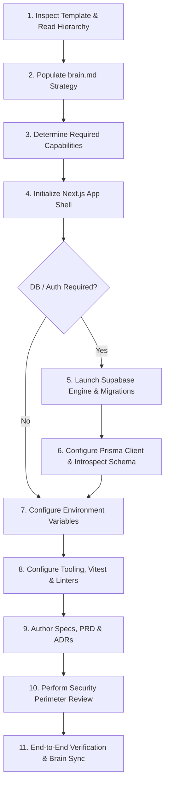

# Project Instantiation & Setup Protocol (`SETUP.md`)

> **Audience**: AI coding agents and developers creating a new project from this template.  
> **Rule**: Adhere to this exact ordered sequence to ensure structural integrity, prevent schema collisions, and avoid accidental complexity.

---

## Operating Philosophy: Scale Up, Not Bloat Down
This template provides enterprise-ready baselines (Next.js, Prisma, Supabase, TypeScript), but **not all projects require all layers**:
- **Simple Public Websites / Content / Tools**: Skip database, auth, and backend mutations. Do not install Prisma or launch Supabase. Unused layers remain dormant without overhead.
- **Full Applications / SaaS Products**: Activate the complete stack adhering strictly to the Prisma/Supabase boundary and defense-in-depth security model.

---

## Ordered Step-by-Step Instantiation Protocol



---

### Step 1: Inspect Template & Read Foundation Documents
Before running commands or modifying files:
1. Read [`project_constitution.md`](project_constitution.md) — understand the Document Precedence Hierarchy, Next.js conventions, Article VI (Migration Pipeline), and the AI Session Protocol.
2. Read [`architecture/tooling-conventions.md`](architecture/tooling-conventions.md) — observe path aliasing (`@/*`), Vitest default, and testing import rules.
3. Read [`architecture/database-migration-boundary.md`](architecture/database-migration-boundary.md) — understand the single Supabase SQL migration pipeline and Prisma introspection boundary.
4. Read root [`README.md`](README.md) — review the directory tree and pillar locations.

---

### Step 2: Populate `brain.md` with Project-Specific Information
`brain.md` is the canonical persistent source of truth. Populate the baseline:
1. **Update Project Metadata**: Set `Last Updated` to today's date, `Updated By` to your agent/developer name, and `Current Phase` to `Discovery` or `Prototyping`.
2. **Fill Core Strategy**: Complete Section 1 (*Product Identity*), Section 2 (*Problem Statement*), Section 3 (*Target Users*), Section 4 (*User Needs*), and Section 5 (*Value Proposition*).
3. **Define Scope & Constraints**: Complete Section 6 (*Product Goals*), Section 7 (*Non-Goals*), Section 9 (*Brand & Design*), and Section 11 (*Important Constraints*).
4. **Declare Stack Decisions**: In Section 15 (*Key Technical Assumptions*), explicitly answer:
   - `Database Required`: `[Yes / No]`
   - `Authentication Required`: `[Yes / No]`
   - `Rendering Strategy`: `[SSR / Static Export / Hybrid]`
   - `Styling Choice`: `[Tailwind CSS / CSS Modules]`

---

### Step 3: Determine Required Capabilities & Scope
Based on `brain.md` Section 14 and Section 15, classify the active capabilities:

| Capability | Simple Website / Public Tool | Full SaaS / App | Activation Action |
| :--- | :--- | :--- | :--- |
| **Relational Database** | Inactive | **Active** | Migrations in Supabase (Step 5), Prisma client in Step 6 |
| **Authentication** | Inactive | **Active** | Activated via Supabase Auth in Step 5 |
| **File Storage** | Inactive (use static) | **Active** | Activated via Supabase Storage in Step 5 |
| **Local Supabase Engine** | Dormant | **Active** | Launched via `supabase start` in Step 5 |
| **Payments / Billing** | Inactive | Optional | Configured in `src/server/integrations/` |

> [!IMPORTANT]
> If a capability is **Inactive**, leave its template directory dormant. Never force dependencies, migrations, or route guards for unused capabilities.

---

### Step 4: Initialize Next.js Application Without Destroying Scaffold
Install and configure Next.js without clobbering existing directories (`src/`, `public/`, documentation):
1. **Initialize `package.json`**:
   ```bash
   npm init -y
   ```
2. **Install Core Next.js & React Dependencies**:
   ```bash
   npm install next@latest react@latest react-dom@latest
   npm install -D typescript @types/node @types/react @types/react-dom
   ```
3. **Configure `tsconfig.json`**:
   Ensure compiler options match [`architecture/tooling-conventions.md`](architecture/tooling-conventions.md):
   ```json
   {
     "compilerOptions": {
       "target": "ES2022",
       "lib": ["dom", "dom.iterable", "esnext"],
       "allowJs": true,
       "skipLibCheck": true,
       "strict": true,
       "noEmit": true,
       "esModuleInterop": true,
       "module": "esnext",
       "moduleResolution": "bundler",
       "resolveJsonModule": true,
       "isolatedModules": true,
       "jsx": "preserve",
       "incremental": true,
       "plugins": [{ "name": "next" }],
       "baseUrl": ".",
       "paths": {
         "@/*": ["./src/*"]
       }
     },
     "include": ["next-env.d.ts", "**/*.ts", "**/*.tsx", ".next/types/**/*.ts"],
     "exclude": ["node_modules"]
   }
   ```
4. **Create `next.config.ts`** at the project root with standard security headers.

---

### Step 5: Configure Supabase Local Engine & Migrations *(Optional — DB/Auth Projects Only)*
*Skip this step if `brain.md` marks Database and Authentication as Inactive.*

Supabase SQL is the **single source of truth** for all database migrations.
1. **Verify Configuration**: Inspect [`supabase/config.toml`](supabase/config.toml). Local direct database runs on port `54322` by default.
2. **Author Initial Migration(s)**:
   Create migration files in `supabase/migrations/` using timestamp prefixes.
   ```bash
   npx supabase migration new initial_schema
   ```
   **Migration Ordering Rules**:
   - *Extensions First*: `CREATE EXTENSION IF NOT EXISTS "uuid-ossp";` or `"vector"` must execute before any tables use them.
   - *Tables & Constraints Second*: Create tables, columns, indexes, and enums.
   - *RLS & Triggers Third*: `ALTER TABLE ... ENABLE ROW LEVEL SECURITY;`, `CREATE POLICY ...`, and triggers referencing the newly created tables.
   - Timestamps determine execution order.
3. **Start Local Docker Engine & Apply Migrations**:
   ```bash
   npx supabase start
   ```
   *Starts local PostgreSQL, Auth, Inbucket (email), and Storage in Docker, automatically applying all `supabase/migrations/*.sql`.*
4. **Record Output Credentials**: Note the local `API URL`, `anon key`, `service_role key`, and `DB URL` printed by the CLI for Step 7.

---

### Step 6: Configure Prisma Client & Introspect Schema *(Optional — Relational DB Projects Only)*
*Skip this step if `brain.md` marks Database as Inactive.*

Prisma is used strictly as an ORM and type-safe query client. **Prisma never runs migrations.**
1. **Install Prisma**:
   ```bash
   npm install @prisma/client
   npm install -D prisma
   ```
2. **Create Baseline `prisma/schema.prisma`**:
   ```prisma
   datasource db {
     provider  = "postgresql"
     url       = env("DATABASE_URL")
     directUrl = env("DIRECT_URL")
   }

   generator client {
     provider = "prisma-client-js"
   }
   ```
3. **Introspect Live Database**:
   Pull the actual database schema created by Supabase into `prisma/schema.prisma`:
   ```bash
   npx prisma db pull
   ```
4. **Generate Typed Prisma Client**:
   ```bash
   npx prisma generate
   ```

---

### Operational Reference: Database Scenarios

| Scenario | Prescribed Command Sequence |
| :--- | :--- |
| **Fresh local project** | 1. `npx supabase start`<br>2. `npx prisma db pull`<br>3. `npx prisma generate` |
| **Normal schema change** | 1. `npx supabase migration new <name>`<br>2. Edit `supabase/migrations/<ts>_<name>.sql`<br>3. `npx supabase migration up`<br>4. `npm run db:sync` *(runs `prisma db pull && prisma generate`)* |
| **Full local reset** | `npm run db:reset` *(runs `supabase db reset && prisma db pull && prisma generate`)* |
| **Remote deployment** | 1. `npx supabase db push`<br>2. `npx prisma generate` *(in CI/build step)*<br>3. Deploy Next.js |
| **Continuous Integration (CI)** | 1. `npx supabase start`<br>2. `npx prisma db pull && git diff --exit-code prisma/schema.prisma`<br>3. `npx prisma generate`<br>4. `npx vitest run`<br>5. `npx supabase stop` |

---

### Step 7: Configure Environment Variables
1. **Copy Template to Local Environment**:
   ```bash
   cp .env.example .env.local
   ```
2. **Populate Secrets**:
   - For public websites: Set `NEXT_PUBLIC_APP_URL="http://localhost:3000"` and `NODE_ENV="development"`.
   - For database/auth projects: Fill `NEXT_PUBLIC_SUPABASE_URL`, `NEXT_PUBLIC_SUPABASE_ANON_KEY`, `SUPABASE_SERVICE_ROLE_KEY`, `DIRECT_URL`, and `DATABASE_URL` using values from Step 5.
3. **Rule**: Never commit `.env.local` to Git. Verify `.gitignore` rules.

---

### Step 8: Configure Tooling & Testing Infrastructure
1. **Install Vitest and Testing Utilities**:
   ```bash
   npm install -D vitest @vitejs/plugin-react jsdom
   ```
2. **Create `vitest.config.ts`** at the project root with the `@/*` path alias mapped to `./src` as defined in [`architecture/tooling-conventions.md`](architecture/tooling-conventions.md).
3. **Install Code Quality Tooling**:
   ```bash
   npm install -D prettier eslint eslint-config-next
   ```
   Add root `.prettierrc` and `eslint.config.mjs`.

---

### Step 9: Author Architecture Specifications & PRDs
1. **Synchronize Product Vision**: Fill [`product/vision.md`](product/vision.md) with concise summaries extracted from `brain.md`.
2. **Draft MVP PRD**: Create `specifications/prds/001-mvp.md` detailing user stories, acceptance criteria, and API requirements for the initial release.
3. **Record Architectural Decisions**: If any default technology was overridden (e.g. choosing Jest over Vitest, or CSS Modules over Tailwind), record an ADR in `decisions/records/` using `decisions/templates/adr-template.md`.

---

### Step 10: Perform Initial Security Review
1. **Secret Isolation**: Confirm that `SUPABASE_SERVICE_ROLE_KEY` and database passwords appear strictly in server-side files and never leak to `NEXT_PUBLIC_` variables.
2. **Database Perimeter**: If a database is active, verify that every table has Row-Level Security enabled.
3. **HTTP Security Headers**: Verify CSP, HSTS, and frame protection in `next.config.ts` or `src/middleware.ts`.
4. **Input Boundary**: Verify that Zod is set up for validating all incoming request payloads.

---

### Step 11: End-to-End Verification Before Completion
Before declaring setup complete, verify:
- [ ] TypeScript compiles cleanly: `npx tsc --noEmit`
- [ ] Linter passes: `npm run lint`
- [ ] Test suite executes: `npx vitest run`
- [ ] Next.js development server runs: `npm run dev` (verify root layout renders)
- [ ] `brain.md` Section 12 (*Current Project State*) is updated to reflect that project initialization is complete and active development has begun.
- [ ] `brain.md` Project Metadata header is updated (`Current Phase: Prototyping` or `MVP Development`).
